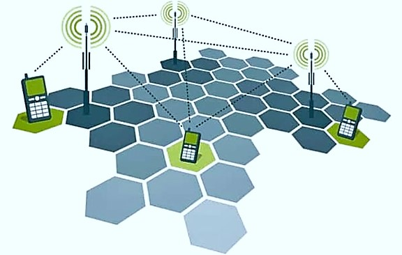
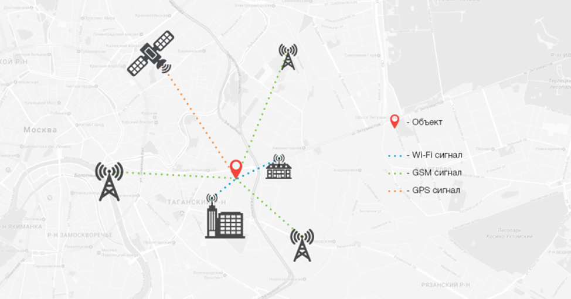
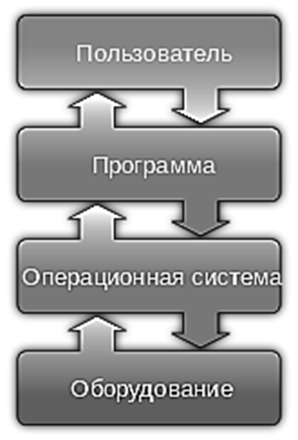

# 1 МОБИЛЬНЫЕ УСТРОЙСТВА

## 1.1 Типы мобильных устройств

Под мобильными устройствами понимают ряд цифровых устройств, характерной особенностью которых является компактный размер, перемещаемость и определенный (иногда ограниченный) набор выполняемых функций. В категорию этих устройств относят не только аппараты, позволяющие поддерживать связь посредством технологий сотовой связи, а также игровые консоли, IoT-устройства (устройства интернета вещей), «умные» часы, планшеты и т.д.

Для понимания приобретения современными смартфонами их нынешнего вида и технологических особенностей, рассмотрим некоторых предшественников.

1 ) Автомобильные радиотелефоны и мобильный радиотелефон – тяжеловесные устройства для обеспечения связи между абонентами. Чтобы поговорить с другим человеком, пользователь звонил на базовую станцию, где оператор подключал его к городской сети. Как и предшественники компьютеров (электронный вычислительные средства), изобретение имело большие габариты по сравнению с нынешними устройствами. Самый легковесный аппарат весил 3 килограмма.

Изначально радиотелефон работал на мобильной радиосвязи – такой способ, при котором информация передается по радиоволнам. Поддержание связи являлось непростой задачей, поскольку, находящиеся рядом радиоприемники могли терять необходимый канал и, нередко, пользователи могли стать свидетелями чужого разговора.

Для исключения проблем с потерей и перехватом каналов, был изобретен отдельный вид мобильной радиосвязи – сотовая связь, особенность которой заключается в расположении базовых станций, принимающих и передающих сигналы, в определенных местах. Рисунок покрытия, при проецировании его на карту, зачастую принимает формы сот, от чего данную связь называют «сотовой» (рисунок 1).

2 ) Пейджер – считается прародителем современных мобильных устройств. По внешнему виду, он походит на небольшой радиоприемник с функцией получения сообщений. Для отправки сообщения, пользователь звонил в специальную пейджиринговую компанию, диктовал текст и номер получателя для отправки, после чего уже оператор отправлял сообщение с компьютера на пейджер другого пользователя. Обычно данная операция занимала около пяти минут. Пейджер считался прямым конкурентом мобильных телефонов и операторов сотовой связи, поскольку товары и услуги последних в начале 90-х годов стоили много дороже. Однако, популярность пейджеров продержалась недолго. Уже к 2000-му году спрос на них сошел на нет в виду удешевления связи и устройств для ее обеспечения.

3 ) Мобильное устройство без сим-карты (кирпич) – достаточно громоздкая трубка с антенной. Для получения связи, абонент обращался в специальную компанию, где в аппарат вшивали чип, позволяющий совершать и принимать звонки. Важно заметить, что данный тип устройств выполнял только эти функции, а компании, обслуживающие и предоставляющие чипы являлись единичными филиалами в крупных городах. 

4 ) Мобильное устройство с сим-картами. Абонент сам выбирал провайдера для осуществления звонков. Популярность таких аппаратов связано со следующими пунктами:
 -	цифровая мобильная связь к этому времени приводится к единому стандарту (GSM). Это говорит о том, что производитель от вопроса обеспечения устройства связью перешел к реализации других улучшенияй, например, уменьшение размеров комплектующих частей;
 -	изобретение никель-металлогибридных батарей, а после переход на литий-ионные аккумуляторы, позволили значительно уменьшить размеры устройства, продлить срок его работы и уменьшить время на подзарядку;
 -	относительно малая цена на само устройство и дешевые тарифы на связь.

С течением времени мобильные телефоны приобрели цветной дисплей, возможность отправки ММS, доступ к мобильному интернету, просмотр мультимедиа, камеру, поддержку карт памяти, встроенные приложения от производителя (телефонная книга, калькулятор, игры) и возможность запуска сторонних приложений (например, java приложения).

5 ) Компактный персональный компьютер (КПК) – портативное вычислительное устройство, обладающее широкими функциональными возможностями, доступные для персональных компьютеров. С «классического» КПК невозможно совершать звонки, и КПК не является мобильным телефоном, поэтому они полностью вытеснены коммуникаторами уже к 2008 году.

6 ) Коммуникаторы — КПК с модулем сотовой связи. Особенность устройства – наличие встроенной клавиатуры. Еще на момент 2008-2009 годов ни сотовые телефоны, ни смартфоны не были оснащены многими функциями из-под коробки, которые были осуществимы при помощи компьютеров или КПК (например, работа с документами).
7 )Смартфон – устройство связи с операционной системой. «Смарт» - умный телефон, названный так к середине 2000-х. Отмечается так же, что в категорию смартфонов относятся устройства связи с сенсорным экраном.

## 1.2 Мобильные технологии

Мобильные технологии – категория технологий, обеспечивающих широкий спектр услуг, в основе которых лежит способность отправлять и получать сигналы для взаимодействия с другими устройствами.

Важность понимания, какие мобильные технологии существуют, объясняется возможностью их использования в самом разрабатываемом программном продукте и спецификой взаимодействия с ними. Например, работа приложения при отсутствии или наличии подключения к сети, как минимум, предполагает логику проверки подключения к ней, а затем, выполнение соответствующих скриптов и блоков программного кода.

Считается, что именно мобильные технологии и Интернет стали движущими силами в развитии информационно-коммуникационных технологий, поэтому, рассмотрим стандарты сети и способы передачи данных в смартфонах.

**Сотовая связь**
Достижения в области сотовой связи в области передачи данных разного типа и дальнейшая разработка программ для работы с ними во многом автоматизировали деятельность человека. Основное различие стандартов касается скорости передачи и поддержания работоспособности сети без перекрывания радиосигнала другими объектами. Существует 5 стандартов сотовой связи, из которых «современными» считают стандарты типа 4G и 5G.

4G (4-Generation) – четвертое поколение беспроводной телефонной связи. Отмечается, что данная сеть обладает следующими возможностями: высокоскоростной доступ в Интернет, IP-телефония, мобильное ТВ высокой четкости, видеоконференции, 3D телевидение и др.

Основное отличие от предыдущих поколений заключается в том, что сеть 4G позволяет пользователям осуществлять звонки не столько через «традиционную» сотовую связь, а через интернет (IP-телефония). Данная технология позволяет передавать информацию со скоростью в пять-семь раз выше, чем 3G.

5G (5-Generation) – современная технология беспроводной телефонной связи. Сети связи «пятого типа» призваны стать базой для внедрения в различные сферы деятельности человека интернета вещей, анализа больших данных, а также искусственного интеллекта.

Рассматриваются следующие инновационные применения 5G:
-	объекты системы «умного» здравоохранения на основе 5G для борьбы с последствиями чрезвычайных ситуаций в сфере общественного здравоохранения;
-	частные виртуальные сети предприятий на основе 5G, ориентированные на интернет и совместное производство;
-	широкомасштабное применение новых технологий 5G в интеллектуальных сетях энергоснабжения (Smart Grid);
-	широкомасштабное тестирование и внедрение синергетических транспортных систем (вида «машина-дорога») на базе 5G;
-	приложения, демонстрирующие возможности применения технологии 5G в сфере «умного образования»;
-	создание системы «умный порт» на основе 5G;
-	создание на основе 5G инфраструктуры для телепроизводства и вещания в формате 4K / 8K UHD.

**IP-телефония**
Технология реализации телефонных разговоров через интернет, вне зависимости от геолокации собеседников. Голос – а точнее, аналоговый сигнал – переводится в цифровой, затем шлюз сжимает и зашифровывает его, превращая в так называемый IP-пакет. Пакет передается по сети получателю, а специальная программа раскодирует его в исходный вид, то есть снова (в обычное голосовое сообщение). Люди не только слышат, но и видят друг друга: IP-связь позволяет проводить видеоконференции – отличный вариант для совещаний, когда собеседники не имеют возможности собраться в офисе.

**Геолокация**
Географические координаты пользователя с использованием вычислительного устройства или механизмов сбора данных.

Данная технология используется во многих приложениях, которые помогают отслеживать местонахождения, например, сотрудников или курьеров.

Обычно, при рассмотрении вопроса о службах геолокации, чаще говорят о GPS (Global Positioning System) – система глобального позиционирования или спутниковая система навигации. Данная технология позволяет определять местоположение пользователя при помощи отправления и получения координат и времени спутников. 

Спутниковая система навигации обеспечивает измерение расстояния, времени и определяет местоположение. Говорится о том, что в основе механизма определения геолокации по GPS лежит принцип трилатерации — математический метод для определения положения, высоты и скорости пользователя.

Для работы с данной технологией используют GPS-модуль, который ловит частоты спутников и рассчитывает необходимые параметры. Устройство принимает координаты спутника, вычисляет время, за которое проходит сигнал, и на основе этих данных определяет геолокацию.

Данные с одного спутника обеспечивают общее расположение точки в большой круговой области на поверхности земного шара.

Второй спутник позволяет сузить местоположение объекта до окружности, где две области спутниковых данных пересекаются.

Третий спутник позволяет определить геолокацию с точностью до 10-20 метров, а четвертый — до 2-3 метров.

Выделяют два вида координат данных от спутников:
-	Альманах включает в себя общие параметры всех спутниковых орбит, эти данные актуальны длительный срок, но не отличаются точностью. 
-	Эфемерида содержит точные координаты спутника и корректировку его текущего положения: данные обновляются каждые 30 секунд и актуальны полчаса.

Скорость загрузки данных со спутников зависит от времени бездействия GPS-модуля в устройстве. Соответственно, если устарели данные эфемерида, то приемник находит спутники примерно за минуту. В случае, когда устаревают данные альманаха, обновление может занимать до 15 минут. Обычно такой тип обновлений запускается тогда, когда модуль определения геолокации был выключен более чем на 30 минут.

В связи с определенным типом обновлений выделяют следующие виды старта модуля:
-	Холодный старт – требуется обновление альманаха;
-	Теплый старт – устарели эфемериды;
-	Горячий старт – когда модуль был отключен на несколько минут и данные эфемерид сохранили актуальность;

Строго говоря, сотовые аппараты не оснащаются высококачественными приемниками GPS, который смог бы словить радиоволны со спутника в городах, где много факторов, перекрывающих сигналы. В помещениях модуль фактически не функционирует, так как межэтажные бетонные перекрытия выступают в роли своеобразных экранов и блокируют сигнал. Кроме того, на работоспособность GPS в смартфоне влияет и погода. Скопления облаков и сильные осадки вызывают преломление и искажение спутникового сигнала. В результате местоположение либо не определяется, либо определяется неточно.

Скорость загрузки данных со спутников зависит от времени бездействия GPS-модуля в устройстве. Соответственно, если устарели данные эфемерида, то приемник находит спутники примерно за минуту. В случае, когда устаревают данные альманаха, обновление может занимать до 15 минут. Обычно такой тип обновлений запускается тогда, когда модуль определения геолокации был выключен более чем на 30 минут.

В связи с определенным типом обновлений выделяют следующие виды старта модуля:
-	Холодный старт – требуется обновление альманаха;
-	Теплый старт – устарели эфемериды;
-	Горячий старт – когда модуль был отключен на несколько минут и данные эфемерид сохранили актуальность;

Строго говоря, сотовые аппараты не оснащаются высококачественными приемниками GPS, который смог бы словить радиоволны со спутника в городах, где много факторов, перекрывающих сигналы. В помещениях модуль фактически не функционирует, так как межэтажные бетонные перекрытия выступают в роли своеобразных экранов и блокируют сигнал. Кроме того, на работоспособность GPS в смартфоне влияет и погода. Скопления облаков и сильные осадки вызывают преломление и искажение спутникового сигнала. В результате местоположение либо не определяется, либо определяется неточно.

Для определения геолокации в смартфоне работает система алгоритмов. В идеальных условиях сигналы GPS, сотовой связи, Wi-Fi и Bluetooth используются совместно, так как это ускоряет процесс вычисления местоположения. Большинство современных устройств по умолчанию умеют работать со всеми методами. Пример взаимодействия разных типов технологий приведен на рисунке ниже.

1	Геолокация по GPS в смартфоне работает за счет встроенного модуля. Для определения локации нужны 4 спутника, остальные — позволяют наиболее точно определить местоположение.

2	Когда сигнал GPS недоступен, смартфон автоматически переключается на другие методы определения местоположения.

3	Для определения геолокации с помощью сотовой связи телефону нужны данные от трех базовых станций связи и время, за которое от них доходит сигнал.

4	Узнать местоположение по Wi-Fi можно только вблизи точек беспроводной связи, поэтому метод задействуется только в густонаселенных районах.

A-GPS – технология, вычисляющая геолокацию пользователя устройства на основе навигационных данных из внешних источников. Если точнее, то

А-GPS — это технология, которая ускоряет «холодный старт» GPS-приемника. A-GPS можно использовать по-разному. Нередко мобильное устройство вообще не принимает спутниковые сигналы. Оно определяет координаты по сигналам сети GSM, если территория очень плотно покрыта станциями. В других случаях приемник получает спутниковые сигналы, а по каналу GPRS оператор предоставляет альманах, эфемериды и список спутников.

Возможен и такой вариант, когда провайдер, предоставляющий услугу A-GPS, принимает данные, которые получил пользователь со спутников, и возвращает готовые значения координат. Важно отметить, что использование сигналов GPS – услуга бесплатная. Услуга A-GPS оплачивается по тарифам, которые установил провайдер сотовой связи.

пользователя внутри помещений, стоит обратить внимание на RTLS – системы определения местоположения ресурсов или персонала в реальном времени. беспроводные метки RTLS прикрепляются к вещам или людям. Фиксированные контрольные точки затем принимают беспроводные сигналы от меток, чтобы определить их точное местоположение. RTLS — это комплексная система, включая теги, датчики якоря, аппаратное обеспечение для чтения, программное обеспечение, возможности интеграции и аналитики.

Остальными технологиями для определения геопозиции в бизнесе являются Wi-Fi/Wi-Fi RTT, Bluetooth® Low Energy, UWB.

**Wi-Fi**
Стандарт беспроводного подключения для коммуникации разных устройств. Так же, как и сотовые сети, технология использует радиоволны для передачи данных. Сигнал ограничен коротким расстоянием, однако способен обеспечивать пользователей доступом к Интернету с высокой скоростью и низкой задержкой передачи пакетов на любом типе устройств, имеющих 
Wi-Fi модуль. Важно отметить, что при отсутствии сети, связать два устройства друг с другом не удастся.

**Bluetooth**
Технология связи человека с окружающими его устройствами (персональные сети). Bluetooth обеспечивает обмен информацией между такими устройствами, как персональные компьютеры, мобильные телефоны, интернет-планшеты, принтеры, цифровые фотоаппараты, мыши, клавиатуры, джойстики, наушники, гарнитуры и акустические системы на надёжной, бесплатной, повсеместно доступной радиочастоте для ближней связи. Bluetooth позволяет этим устройствам сообщаться, когда они находятся друг от друга в радиусе около 100 м в старых версиях протокола и до 150 м начиная с версии Bluetooth 5.

## 1.3 Мобильные операционные системы

Операционная система – программное обеспечение, основная цель которого – обеспечивать работоспособность разных компонентов и программ устройства, а также предоставлять пользователю графический интерфейс длявзаимодействия.

Мобильные операционные системы – системное программное обеспечение, предназначенное для смартфонов, планшетов и других подобных устройств.

Ноутбуки так же входят в категорию мобильных устройств, однако их специфика аппаратного обеспечения и предоставляемых функций диктует использование других операционных систем.

Основные функции мобильной ОС приведены ниже:
-	Управление процессором/планирование: когда в системе запущено несколько процессов, операционная система определяет, когда и как каждый процесс использует ЦП.
-	Управление памятью: при «многопроцессорности» распределяет память. Отслеживает, ее использование.
-	Управление файлами: ведет журнал местонахождения и состояния файлов. Очищает и освобождает память.
-	Безопасность: благодаря аутентификации ОС обеспечивает безопасность системы и программ. Легитимность пользователя определяется его идентификатором пользователя (логином) и паролем.

На рисунке ниже представлено графическое представление взаимодействия пользователя с оборудованием, где определяется место операционной системы. Обратите внимание, что это место основного блока, благодаря которому проводится данное взаимодействие.

Другие функции: Обнаружение ошибок. Отслеживание производительности системы. Взаимодействие между различными программными приложениями.

В мире используется несколько основных операционных систем для мобильных устройств, на которых работает большинство смартфонов. Ниже приведены некоторые из них.

**Android**

Самая популярная операционная система для мобильных устройств в мире. Большинство смартфонов и планшетов работают на базе этой платформы, но она не является единственным вариантом для мобильных технологий.

Данная система является открытой, это значит, что её исходный код находится в открытом доступе, и каждый имеет право свободно использовать или модифицировать этот код. Таким образом, система является привлекательной как для разработчиков программ, так и для производителей смартфонов, ведь работать с ней значительно дешевле и проще, чем со многими другими.

Разработка системы началась в 2003 году с основания компании Android Inc. B 2005 году эта компания была приобретена Google, а первый смартфон с этой системой на борту увидел свет в 2008 году. На сегодняшний день система активно поддерживается как крупными компаниями во главе с Google, так и независимыми разработчиками.

**Apple iOS**

Альтернативная операционная система от компании Apple, используемая на устройствах iPhone, iPad и iPod Touch. Она известна своей простотой использования и хорошей оптимизацией, а также большим количеством приложений, доступных в App Store.

Данная ОС во многом изменила представление об эргономике мобильных операционных систем, впервые реализовав технологию MultiTouch, а также, оптимизировав пользовательский интерфейс под большой сенсорный экран с высоким разрешением. Сама система является полностью закрытой – это значит, что исходный код системы остается недоступным и работать с ним может только владелец – компания Apple.

**Windows Phone**

Операционная система от компании Microsoft, которая предлагает уникальный интерфейс и интеграцию с другими продуктами этой компании, такими как Windows и Xbox. Однако, Windows Phone не обладает популярностью, как у Android и iOS.

Windows Mobile в течение долгих лет оставалась основным конкурентом Symbian. Однако, данная платформа отличалась высокими системными требованиями, не достаточно удобным интерфейсом и в целом ориентировалась на использование в деловой сфере. Поэтому в конце 2010 года Microsoft выпускает новую систему с полностью переработанным пользовательским интерфейсом, ориентированную, прежде всего, на потребителя – Windows Phone 7. Пользовательский интерфейс, основанный на дизайнерской философии Metro, специально разработанной Microsoft для этой операционной системы, отличается эргономичностью и уникальным визуальным стилем.

**BlackBerry OS**

Операционная система для устройств BlackBerry, которая нашла широкое распространение среди бизнесменов и людей, ценящих высокую безопасность. Она славится своими клавиатурными смартфонами и удобным интерфейсом для работы с электронной почтой.

BlackBerry OS предлагал множество функций и приложений для повышения производительности и удобства использования устройств. Включая такие возможности, как BlackBerry Messenger (возможность обмениваться сообщениями с другими пользователями BlackBerry), BlackBerry Maps (навигационная система), BlackBerry App World (платформа для скачивания и установки приложений).

Однако в связи с резким снижением популярности устройств BlackBerry, компания приняла решение перейти на использование операционной системы Android в новых моделях своих смартфонов, начиная с модели BlackBerry Priv.

**Серия Symbian**

Эта операционная система была разработана в компании Nokia и использовалась на их мобильных устройствах. Однако, с развитием Android и iOS, Symbian стал утрачивать свою популярность и был заменен на Windows Phone.

Разработка данной системы началась во второй половине 90-ых годов, а первый коммуникатор на ней увидел свет в 2001 году. Данная система долгое время была фактически единственным игроком на рынке коммуникаторов, получив широкую поддержку производителей мобильных устройств. 

Наибольшего успеха с Symbian добилась компания Nokia, которая в 2008 году стала единственным владельцем этой системы. Последняя версия системы была официально переименована в Nokia Belle и вышла в 2011 году.

**Tizen**

Операционная система для мобильных устройств, разработанная Linux Foundation совместно с Samsung и другими компаниями. Она используется в некоторых смартфонах и умных часах Samsung. Tizen предлагает собственное приложение-магазин и поддерживает широкий спектр функций. Имеет функции безопасности, включая аутентификацию пользователя и шифрование данных, чтобы обеспечить защиту личной информации на устройствах крупной компании.

Благодаря своей гибкости и многофункциональности, Samsung Tizen становится все более популярной операционной системой для мобильных устройств, предлагая пользователям удобство и разнообразие при использовании своих устройств.

**Firefox OS**

Операционная система, разрабатываемая некоммерческой организацией Mozilla. Эта платформа была создана для работы на мобильных устройствах и базируется на открытых стандартах. Firefox OS изначально нацелена на устройства с низкими техническими характеристиками и предоставляет доступ ко множеству веб-приложений.

Однако Firefox OS не смогла обрести широкую популярность и конкурировать с Android и iOS. В 2016 году Mozilla объявила о прекращении разработки и поддержки операционной системы. Вместо этого компания решила сосредоточиться на других направлениях, таких как развитие браузера Firefox и сервисов веб-разработки.

В итоге, хотя Firefox OS не сумела стать успешной платформой для мобильных устройств, она привнесла в индустрию новые идеи и подходы. В своей эпохе она была одним из первых попыток создания полноценной операционной системы на базе веб-технологий.

**Ubuntu Touch**
Операционная система для смартфонов и планшетов, базируется на популярном дистрибутиве Linux — Ubuntu. Она отличается от других платформ своим дизайном и концепцией смартфона, который может превращаться в полноценный настольный компьютер.
