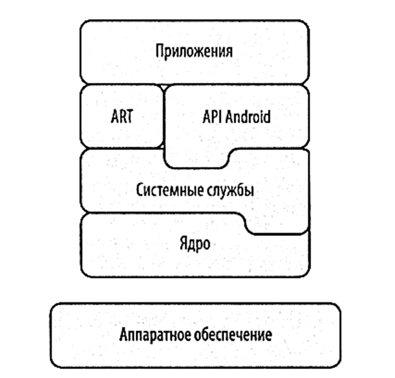
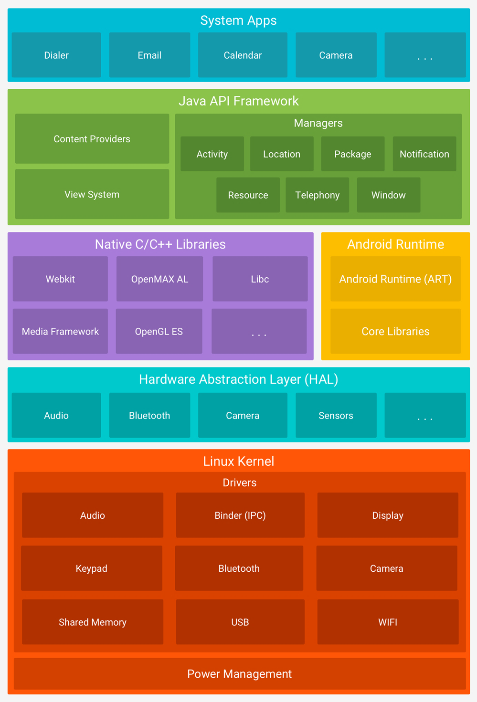

# 2 ОПЕРАЦИОННАЯ СИСТЕМА ANDROID. ЗАПУСК ПРИЛОЖЕНИЙ

Мобильное приложение – программа, предназначенная для работы на мобильном устройстве. Она состоит из инструкций, которые должны быть понятны для исполнения процессором. Процессор, в свою очередь, управляет работой операционной системы в соответствии с полученными последовательностями к выполнению. Это учит нас тому, что разработчик должен знать или понимать основы управления той операционной системой, для которой он будет писать программу.

Разные операционные системы диктуют свои правила написания программ. Таким образом, программа, написанная для Android, не может быть исполнена в iOS или Windows.

В некоторых случаях, необходимо не только понимать особенности взаимодействия программы с операционной системы, но также и особенности работы с разными типами процессоров. Хотя существуют стандартизированные виды архитектур, некоторые производители могут вносить свои изменения. В рамках данного курса не будут затрагиваться особенности разработки под конкретные процессоры, однако, разработчиком мобильных приложений приходится учитывать и данный момент.

Подавляющее число студентов имеют в обращении ноутбуки и смартфоны разных фирм, поэтому, в данном курсе упор будет произведен в сторону создания приложений для ОС Android, поскольку разработка под данную ОС не требует наличия специального оборудования и программного обеспечения. В материале ниже рассмотрим теоретические вопросы касательно архитектуры данной операционной системы.

## 2.1 Архитектура операционной системы
Операционная система Android – свободно поставляемое программное обеспечение на базе ядра Linux изобретенное для широкого перечня устройств разного назначения (бытовая техника, смартфоны, планшеты и т.д.). Она состоит из нескольких слоев (рисунок 4). Каждый уровень предоставляет определенные службы для выполнения конкретных задач и использует возможности нижнего слоя, если это необходимо для выполнения функции.

Стэк технологий (набор инструментов, применяющийся при работе) операционной системы включает:
-	 Ядро (Linux Kernel)
-	 Системные службы (Hardware Abstraction Layer)
-	 Нативные библиотеки (Native Libraries)
-	 Виртуальная машина (Android Runtime)
-	 Интерфейсы Java
-	 Системные приложения
      
На рисунке 5 приведена более подробная архитектура операционной системы.

**Linux Kernel**
Ядро – базовый уровень информационных систем, предоставляющий основные службы, драйверы для взаимодействия с оборудованием, файловые системы, службы для управления потоками и процессами, доступами к сети, интерфейсы для аппаратных устройств и т.д. 

**Системные службы**
Обеспечивают связь между драйверами и библиотеками. Если рассматривать данный слой детально, то он включает в себя широкий спектр утилит, которые работают и как часть ядра (драйверы и модули ядра), так и приложения с длительным временем запуска для управления служебными задачами или библиотеки для выполнения стандартных функций.

**Android Runtime (Art)**
Перед архитекторами системы стояла задача создать такую платформу, которая поставлялась бы на разные устройства, для которых исполняемая программа могла быть написана в единственном экземпляре (а не столько одинаковых программ, сколько устройств и процессоров). Такое кроссплатформенное поведение уже было реализовано в Java - для запуска приложений на данном языке необходима виртуальная машина – Java Virtual Machine (JIT). Поэтому для Android первым и основным языком написания программ был именно этот язык. А для оптимизации запуска приложений на операционной системе использовалась виртуальная машина Android Runtime (ART).

В основном, выделяют следующие варианты оптимизации, используемые в ART:
-	 just-in-time (JIT) – файл приложения компилируется (преобразуются) в машинно-читаемый бинарный код (байт-код) во время запуска приложения
-	 ahead-of-time (AOT) – компиляция байт-кода заранее. Т.е. система сама решает, когда и какой код компилировать.

**Native C/C++ Libraries**
Как описано в названии, данный слой предоставляет средства для использования библиотек, написанных на языках C и C++, например, из представленных на рисунке:
-	WebKit – представляет из себя движок веб-браузера и другие связанные с ним функции.
-	Media Framework – предоставляет медиа кодеки, позволяющие записывать и воспроизводить различные медиа-форматы.
-	OpenGL – используется для отображения 2D и 3D графики.
-	и т.д.

**Application Framework**
Application Framework (каркас приложений) – набор Java классов, предоставляющий приложениям интерфейс к функциям операционной системы и библиотекам. API (Application Programming Interface) – программный интерфейс приложения в виде исполняемых функций для взаимодействия.

**Системные приложения**
На вершине стека находятся приложения, которые могут вызывать другие приложения, например: камера, контакты, вызов номера.

## 2.2 Компиляция Java приложений 

    omg

 

